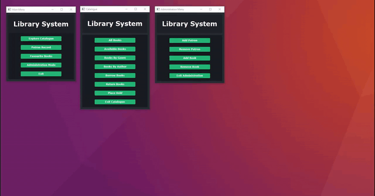

 

  

<h3 align="center">Library System</h3>

    A multi-purpose library management system coded in Java using the MVC architecture.
     
     
    <a href="https://github.com/ShaanCoding/Library-System"><strong>Explore the docs »</strong></a>
     
     
    <a href="https://github.com/ShaanCoding/Library-System">View Demo</a>
    .
    <a href="https://github.com/ShaanCoding/Library-System/issues">Report Bug</a>
    .
    <a href="https://github.com/ShaanCoding/Library-System/issues">Request Feature</a>
  

    

## Table Of Contents

* [About the Project](#about-the-project)
* [Built With](#built-with)
* [Contributing](#contributing)
* [License](#license)
* [Authors](#authors)
* [Acknowledgements](#acknowledgements)

## About The Project

This project was made in order to further understand Java as well as the MVC architectural design pattern. This project acts as a standard graphical library management system, able to run multiple concurrent windows and update them all in real-time regardless of the order. In addition, this project contains multiple quality of life features allowing librarians to quickly sort and or monitor their current inventory of book, I hope this program ends up being of use to someone.

## Built With

This project was built with just the base Java libraries using JavaFX.

## Contributing

Contributions are what make the open source community such an amazing place to be learn, inspire, and create. Any contributions you make are **greatly appreciated**.

* If you have suggestions for adding or removing projects, feel free to [open an issue](https://github.com/ShaanCoding/Library-System/issues/new) to discuss it, or directly create a pull request after you edit the *README.md* file with necessary changes.
* Please make sure you check your spelling and grammar.
* Create individual PR for each suggestion.
* Please also read through the [Code Of Conduct](https://github.com/ShaanCoding/Library-System/blob/main/CODE_OF_CONDUCT.md) before posting your first idea as well.

### Creating A Pull Request

1. Fork the Project
2. Create your Feature Branch (`git checkout -b feature/AmazingFeature`)
3. Commit your Changes (`git commit -m 'Add some AmazingFeature'`)
4. Push to the Branch (`git push origin feature/AmazingFeature`)
5. Open a Pull Request

## License

Distributed under the MPL-2.0 License. See [LICENSE](https://github.com/ShaanCoding/Library-System/blob/main/LICENSE.md) for more information.

## Authors

* **Shaan Khan** - *Owner* - [Shaan Khan](https://github.com/ShaanCoding/) - *Created the project*

## Acknowledgements

* [ShaanCoding](https://github.com/ShaanCoding/)
* [Othneil Drew](https://github.com/othneildrew/Best-README-Template)
* [ImgShields](https://shields.io/)
